# Aqli — User Journeys & Build Checklist

> Single source of truth for what we're designing and what's still missing.
> Update the checkboxes as screens land. Keep flows in sync with the PRD.

**Legend:** ✅ designed · 🟡 partial · ⬜ missing

---

## 1. Sitemap

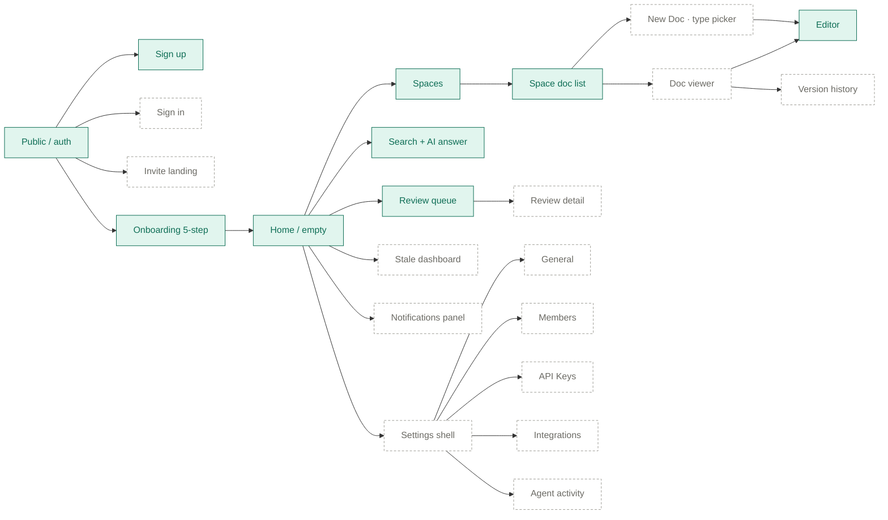

---

## 2. Journeys (detailed)

### J·01 First-time setup ✅
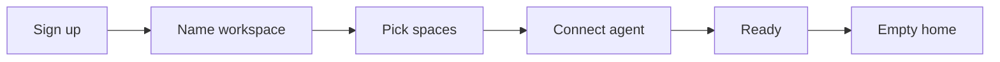
- [x] Sign up — `OB1`
- [x] Name workspace — `OB2`
- [x] Pick spaces — `OB3`
- [x] Connect agent — `OB4`
- [x] Ready — `OB5`
- [x] Empty home — `07`

### J·02 Returning user ✅
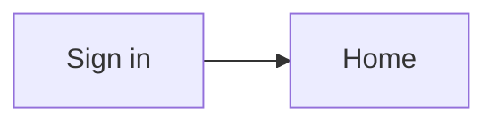
- [x] **Sign in** — `14`
- [x] Home — `01`

### J·03 Invited teammate ✅
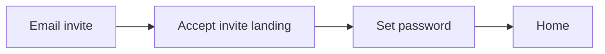
- [ ] Email invite template (mock only)
- [x] **Accept invite landing** — `15`
- [x] **Set password** — `15`
- [x] Home — `01`

### J·04 Browse & read a doc ✅
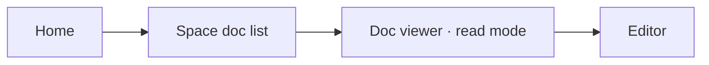
- [x] Home — `01`
- [x] Space doc list — `02`
- [x] **Doc viewer (read mode)** — `08`
- [x] Editor — `03`

### J·05 Create a new doc ✅
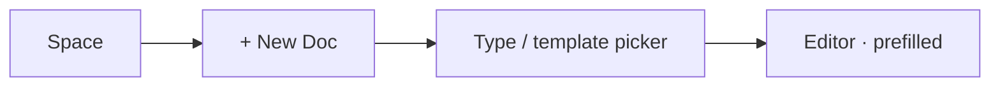
- [x] Space — `02`
- [x] **New Doc trigger / type picker** — `10`
- [x] **Template preview** — `10`
- [x] Editor — `03`

### J·06 Doc lifecycle (Draft → Review → Approved → Stale) 🟡
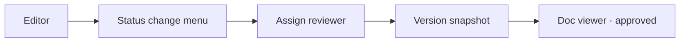
- [x] Editor — `03`
- [x] **Status change menu** — in viewer status bar (`08`/`09`)
- [x] **Reviewer assignment** — in Request Review modal (`09`)
- [🟡] Version snapshot — shown in right rail (`08`), no dedicated confirm UI yet
- [x] Approved doc viewer state — `08`

### J·07 Review agent output ✅
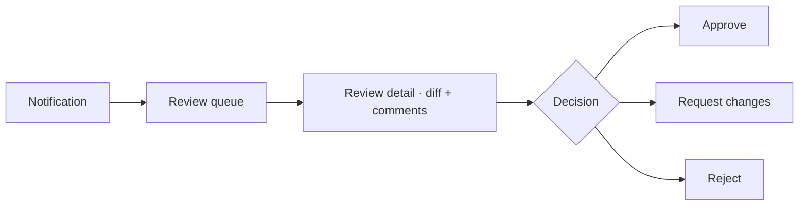
- [x] **Notification surface** — `11`
- [x] Review queue — `04`
- [x] **Review detail (diff + comments)** — `12`
- [x] **Approve confirm** — `27`
- [x] **Request changes** — `13`
- [x] **Reject confirm** — `28`

### J·08 Search & ask ✅
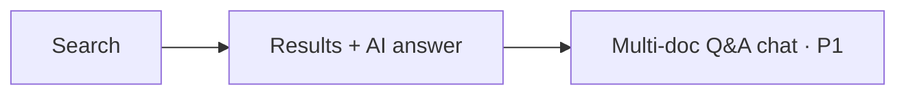
- [x] Search — `05`
- [x] AI answer with citations — `05`
- [ ] Multi-doc Q&A chat (P1)

### J·09 Add another AI agent ✅
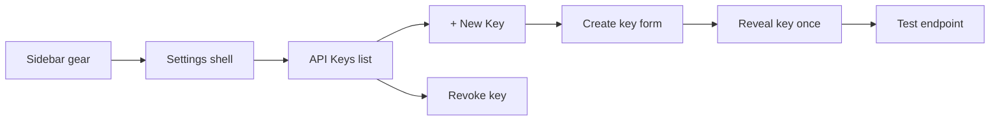
- [x] **Settings shell + sub-nav** — `SET1`
- [x] **API Keys list** — `SET2`
- [x] **New Key form (scope + spaces)** — `SET3`
- [x] **Reveal key dialog (one-time)** — `SET4`
- [x] **Test endpoint hint / curl snippet** — in reveal modal `SET4`
- [ ] Revoke confirmation — menu exists, confirm dialog pending

### J·10 Invite a teammate ✅
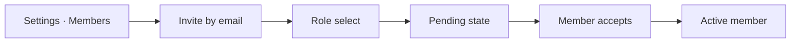
- [x] **Members list** — `16`
- [x] **Invite by email dialog** — `16`
- [x] **Role select (Admin / Editor / Viewer)** — `16`
- [x] **Pending / Active states in list** — `16`

### J·11 Add another Space ✅
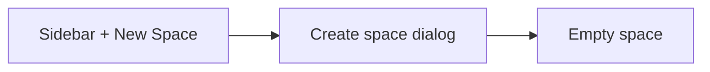
- [x] Sidebar + New Space — `01`
- [x] **Create Space dialog** — `17`
- [x] **Empty space** state — `18`

### J·12 Connect integrations ✅
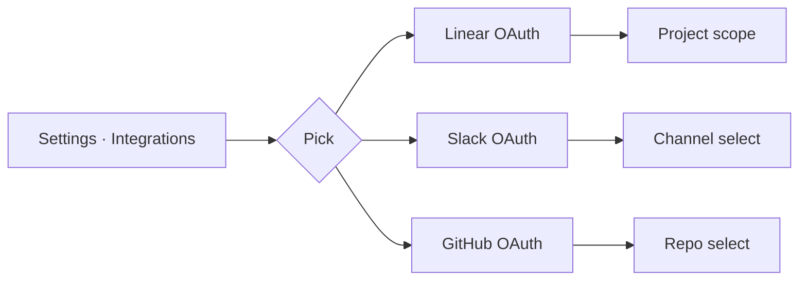
- [x] **Integrations list (Linear, Slack, GitHub, MCP)** — `19`
- [x] **Linear connect + project scope + behaviour rules** — `20`
- [x] **Slack connect + channel routing** — `24`
- [x] **GitHub connect + repo + branch mapping** — `25`

### J·13 Version history & audit ✅
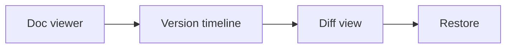
- [x] **Version timeline** — `21`
- [x] **Side-by-side diff** — `21`
- [x] **Restore version action** — `21`

### J·14 Stale doc hygiene · P1 ✅
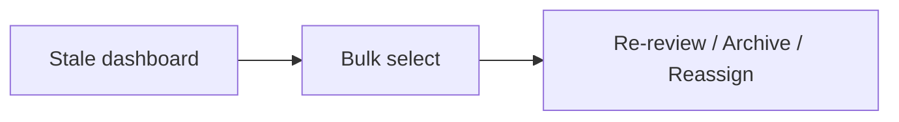
- [x] **Stale dashboard** (sorted by risk + age) — `22`
- [x] **Bulk select + actions** — `22`
- [x] **Agent-refresh hint** — `22`

### J·15 Notifications · P1 ✅
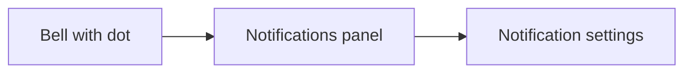
- [x] Bell with dot — topbar
- [x] **Notifications panel** — `11`
- [x] **Notification settings page** — `26`

---

## 3. Master checklist

### Designed (covered)
- [x] OB1 — Sign up
- [x] OB2 — Name workspace
- [x] OB3 — Pick spaces
- [x] OB4 — Connect first agent
- [x] OB5 — Ready
- [x] 01 — App shell / Home
- [x] 02 — Space doc list (Engineering)
- [x] 03 — Doc editor (PRD mid-edit)
- [x] 04 — Agent review queue
- [x] 05 — Search + AI answer
- [x] 06 — Doc list (dark mode)
- [x] 07 — Empty workspace
- [x] SET1 — Settings · Workspace
- [x] SET2 — Settings · API Keys
- [x] SET3 — Settings · New Key dialog
- [x] SET4 — Settings · Reveal Key (one-time)
- [x] 08 — Doc viewer (Approved)
- [x] 09 — Doc viewer + Request Review modal
- [x] 10 — New Doc · Type & template picker
- [x] 11 — Notifications panel
- [x] 12 — Review detail (diff + comments + agent context)
- [x] 13 — Review · Request changes modal
- [x] 14 — Sign in
- [x] 15 — Invite landing
- [x] 16 — Settings · Members + Invite dialog
- [x] 17 — Create Space dialog
- [x] 18 — Empty Space
- [x] 19 — Settings · Integrations
- [x] 20 — Linear · Configure (project scope, behaviour rules)
- [x] 21 — Version history (timeline + diff + restore)
- [x] 22 — Stale dashboard
- [x] 23 — Settings · Agent activity log
- [x] 24 — Slack · Configure (channel routing + quiet hours)
- [x] 25 — GitHub · Configure (repos + mirror behaviour)
- [x] 26 — Settings · Notifications (channel matrix + quiet hours)
- [x] 27 — Review · Approve confirm
- [x] 28 — Review · Reject confirm

### Future work · V1.2 and beyond

- [ ] Email invite template (HTML body)
- [ ] Mobile read-only viewer
- [ ] Multi-doc Q&A chat (PRD P1)
- [ ] Public space (read-only public URL)
- [ ] Audit export for SOC2 (CSV/JSON)

### Previously planned batches (all shipped)

**Batch 1 — Add another AI agent (J·09) ✅ SHIPPED**
- [x] Settings shell w/ sub-nav
- [x] Settings · API Keys (populated list)
- [x] New API Key dialog
- [x] Reveal API Key dialog (one-time)

**Batch 2 — Doc lifecycle (J·04, J·05, J·06) ✅ SHIPPED**
- [x] Doc viewer (read mode) — `08`
- [x] New Doc — type / template picker — `10`
- [x] Status change menu (Draft → Review → Approved) — `08`/`09`
- [x] Reviewer assignment — `09`

**Batch 3 — Review detail (J·07) ✅ SHIPPED**
- [x] Review detail screen — `12`
- [x] Request changes flow — `13`
- [x] Notifications panel triggering review — `11`
- [ ] Approve / Reject confirms (polish)

**Batch 4 — Team & workspace (J·02, J·03, J·10, J·11) ✅ SHIPPED**
- [x] Sign in — `14`
- [x] Invite landing — `15`
- [x] Settings · Members + invite dialog — `16`
- [x] Create Space dialog — `17`
- [x] Empty space — `18`

**Batch 5 — Integrations & version history (J·12, J·13) ✅ SHIPPED**
- [x] Settings · Integrations list — `19`
- [x] Linear configure detail — `20`
- [x] Version history (timeline + diff) — `21`
- [ ] Slack / GitHub detail (mirror Linear pattern — V1.1)

**Batch 6 — Trust & hygiene · P1 (J·14) ✅ SHIPPED**
- [x] Stale docs dashboard — `22`
- [x] Agent activity log — `23`
- [ ] Notification settings page (V1.1)
- [ ] Multi-doc Q&A chat (P1 — future)

---

*Last updated: V1.1 polish shipped — 28 screens, 15/15 journeys covered. Design complete; ready for handoff.*
