# Aqli v3 — Journeys

> Maps 1:1 to **Aqli v3 - Screens.html** (frames 01–19) and **Aqli v3 - Write.html**.
> This replaces the v1/v2 journey doc entirely. The 28-screen map, the Review
> Queue, the three-rail editor and the 5-step onboarding it described no longer
> exist in the design.

**Frames:** 01–03 onboarding · 04 first run · 05 write · 06 read · 07 home ·
08 space · 09 checks · 10 settings AI access · 11 search · 12–14 phone ·
15 drafts · 16 doc history · 17 settings people · 18 settings integrations ·
19 retired routes.

---

## 1. Sitemap

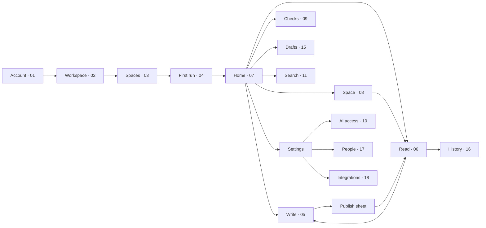

Nine destinations, not twenty-eight. No `/review`, no `/stale`, no
`/agent-log`, no `/new` — see frame 19 for where each job went.

---

## 2. Journeys

### J1 · Get in and write (the only journey that must be perfect)
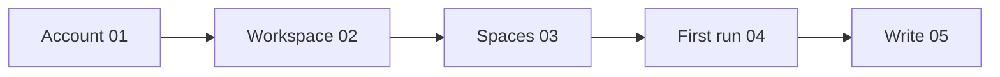
Three screens, then a cursor. Email + password on one screen; workspace name
pre-filled from the email domain and the URL derived, not asked; one space
pre-ticked and Skip a real button. No AI-key step — it lives in Settings ·
AI access (10) and is optional forever.

**Success measure:** first keystroke inside 60 seconds of landing.

### J2 · Write a doc
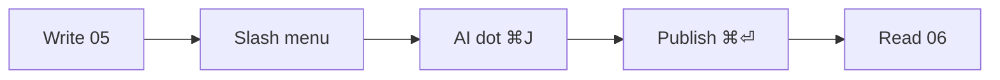
- Bare paper column, 712px measure, serif 18.5px. No rail, no badges, no
  status, no doc-type picker, no owner field.
- `/` inserts structure. `⌘J` is the one AI affordance — a quiet dot, not a panel.
- Every process question (space, type, owner, who should check it) is asked
  once, in the **Publish sheet** on `⌘⏎`, when the answers are actually known.
- Unpublished work is invisible to everyone else. See Drafts (15).
- Interactive: **Aqli v3 - Write.html**.

### J3 · Read a doc
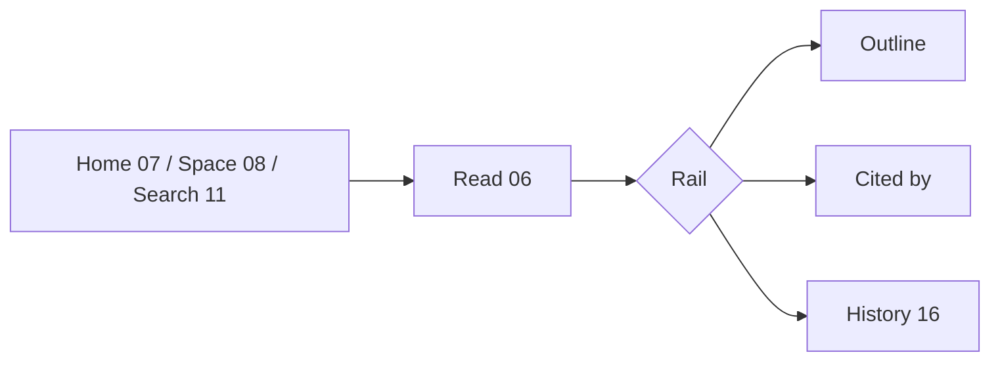
One trust line under the title (`Current · checked by Sara, 5 days ago`).
Cited-by sits at the foot of the doc. The rail ships **collapsed** — frame 06
shows it open only to document it.

### J4 · Check something / be asked to check something
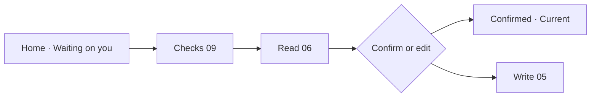
Replaces the old Review Queue and its approve/reject/request-changes modal set.
Reads as a to-do, not a tribunal. Agent drafts land here too — a person
confirms every one (rule shown in 10).

### J5 · Finish a draft
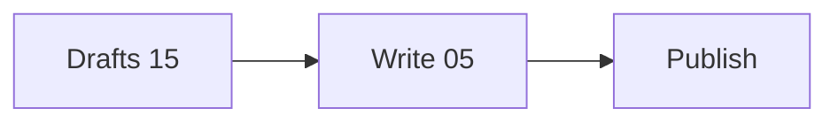
Framed around finishing, not around review. Two groups: yours, and ones
others started and shared with you.

### J6 · Find what exists
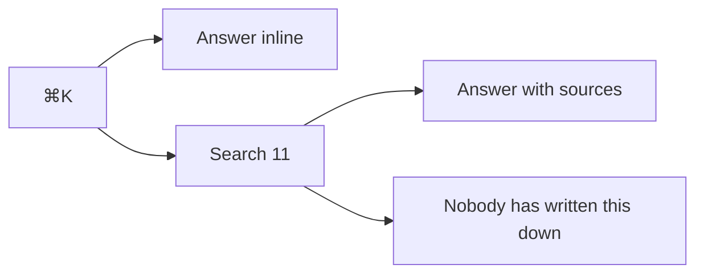
`⌘K` answers fast; frame 11 is for when the answer needs its sources shown.
Unanswered questions are surfaced as gaps here and on Home — that's the whole
of "content strategy" in this product.

### J7 · Browse a space
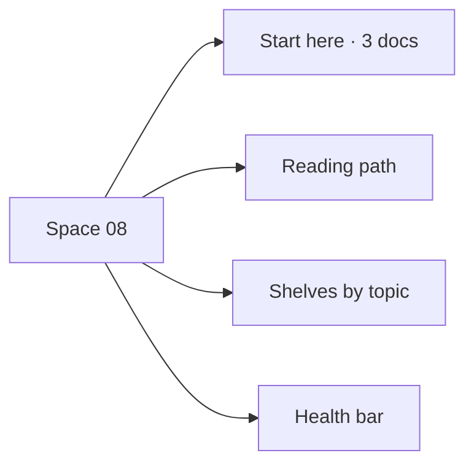
Shelves and a health bar, not a filterable table of doc types. Space icons
(Book, Flag, Gear, Users, Table, Chat, Archive, Folder) replace emoji, though
an emoji can still be chosen.

### J8 · Trace a change
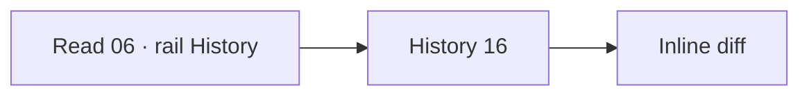
Versions left, the change itself right, in prose: who edited, who confirmed,
which citing docs were re-checked.

### J9 · Set the workspace up (admin, out of the way)
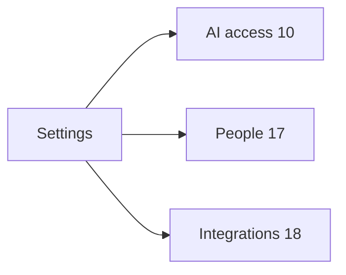
Three pages, reached deliberately. People merges members and pending invites
into one list. Integrations states what each connection *writes into the
workspace*, not which logos we support.

### J10 · Read and capture on a phone
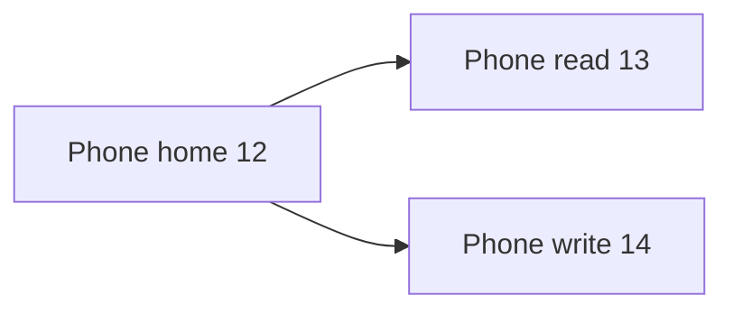
Read and capture only. No checks, no settings, no space browsing on mobile.

---

## 3. What v3 deletes

| Retired | Where the job went |
|---|---|
| `/stale` dashboard | The **Ageing** state, carried by the doc everywhere it appears + one filter chip on 08 |
| `/agent-log` | Per-key counts in Settings · AI access (10); the drafts themselves arrive in Checks (09) |
| `/review` + sidebar "Workflow" group | **Checks** (09), top-level, human words |
| `/s/[space]/new` type picker | Deleted. Write starts at a cursor; type and space are asked in the Publish sheet |
| Editor right rail (outline, citations, consistency) | Hidden by default; outline / cited-by / history live in the collapsed reading rail |
| Owner, review requests, status controls in the editor | The Publish sheet only |
| Four statuses (Draft/Review/Approved/Stale) + AutoApproved chip | One dot: **Current · Ageing · Unverified** |
| Notifications panel, notification settings, agent activity, stale dashboard, approve/reject/request-changes modals, invite landing, empty states as separate screens | Absorbed into Home, Checks and Publish |

---

## 4. State vocabulary

One dot, three states, identical on every surface (list, search, sidebar,
space, phone, history):

- **Current** — someone has confirmed it recently.
- **Ageing** — nobody has confirmed it in a while.
- **Unverified** — never confirmed, or changed since it last was.

No lifecycle language. No "Draft" as a status — a draft is a place (15), not a
state.

---

## 5. Coverage

All ten journeys are drawn. Frames fit their content with no internal
scrolling.

**Not yet designed:** email invite body, public read-only space URL, audit
export, multi-doc chat. None block the v3 handover.

*Last updated: Aug 30, 2026 — rewritten against the v3 screen set.*
